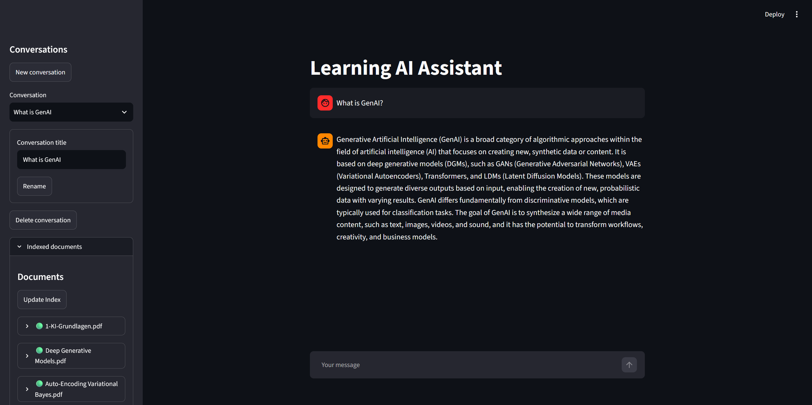
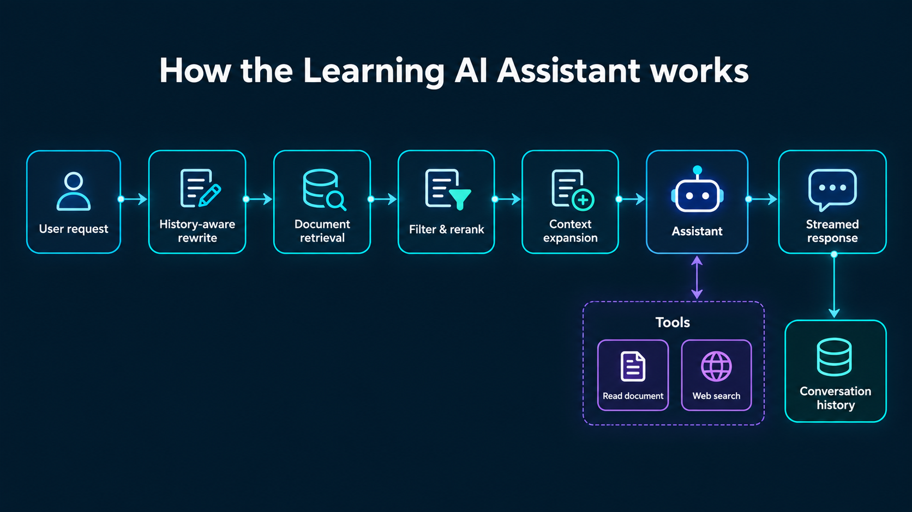

# Learning AI Assistant

Learning AI Assistant is a document-aware chat application for exploring a private knowledge collection. It combines persistent conversations, an advanced retrieval pipeline, and model-invoked tools in a compact Streamlit interface. Both OpenAI and locally hosted Ollama models are supported for chat and embeddings.

The application was developed as a university project, but the repository is documented as a standalone application and reference implementation.



## What it can do

- Answer questions from a collection of PDF and text documents using history-aware RAG.
- Improve retrieval with query rewriting, relevance filtering, LLM reranking, and context expansion.
- Read a complete indexed document or optionally search the web when excerpts are insufficient.
- Persist and manage multiple conversations while streaming model responses.
- Incrementally update the document index and show the status of each indexed file.
- Run with OpenAI, Ollama, or a mix of cloud and local chat and embedding providers.

## Quick start

1. Follow the [setup guide](docs/setup.md).
2. Review the available [configuration options](docs/configuration.md).
3. Put documents in the configured document directory.
4. Start the application:

   ```powershell
   streamlit run app.py
   ```

5. Open **Indexed documents** in the sidebar and select **Update Index** before asking the first document-related question.

The setup guide includes complete examples for both a cloud-backed OpenAI configuration and a local Ollama configuration.

## How it works

For each user turn, the assistant rewrites the request using recent conversation history, retrieves and refines relevant document chunks, and then answers directly or invokes a tool. Only the user message and final assistant response are stored in conversation history.



See [architecture](docs/architecture.md) for the component boundaries, indexing flow, failure behavior, and design tradeoffs.

## Provider choices

| Chat | Embeddings | Typical use |
|---|---|---|
| OpenAI | OpenAI | Minimal local compute and strong hosted models |
| Ollama | Ollama | Local processing of prompts and document contents |
| OpenAI | Ollama | Local document embeddings with hosted answer generation |
| Ollama | OpenAI | Local chat with hosted embeddings |

Provider mixing is supported, but it changes which parts of the workflow remain local, as described under **Data and privacy**.

## Technology

- Python 3.11
- Streamlit
- LangChain provider integrations
- OpenAI and Ollama
- FAISS vector search
- SQLite persistence
- Tavily web search

## Data and privacy

The application, conversations, and document index run locally. Data leaves the machine only through services the user enables:

- OpenAI chat receives prompts, conversation context, retrieved document excerpts, and tool results.
- OpenAI embeddings receive document chunks during indexing and queries during retrieval.
- Tavily receives search queries only when optional web search is enabled.

Using Ollama for both chat and embeddings with web search disabled keeps the complete workflow local. Mixed provider configurations are supported, so users can choose the boundary appropriate for their data.

For development, `prompt_debug.txt` stores the latest complete assistant prompt locally. It can contain conversation and document content and should be disabled where prompt retention is not acceptable.

## Current limitations

- The document collection comes from one configured directory and its subdirectories; there is no drag-and-drop upload or simple per-file include/exclude control.
- Only text-based PDF and UTF-8 `.txt` documents are supported; scanned PDFs require OCR before indexing.
- The full-document tool requires an exact filename and rejects ambiguous duplicate filenames.
- Source references are produced from filename and page metadata by the model, not by a deterministic citation renderer.
- Provider and model selection is configured in `config.py`, not in the UI.
- The application is a single-user reference implementation rather than a hardened multi-user service.

## Possible extensions

Potential follow-up work includes structured source citations, hybrid retrieval, metadata filters, OCR and additional document formats, document management actions, automatic conversation summaries, and an MCP adapter for externally hosted tools. These are extension ideas, not currently implemented features.

## Tests

Run the test suite from the repository root:

```powershell
python -m unittest discover -s tests -v
```

The tests cover the implemented control flow and component behavior. Qualitative evaluation of answer and retrieval quality remains model- and corpus-dependent.
