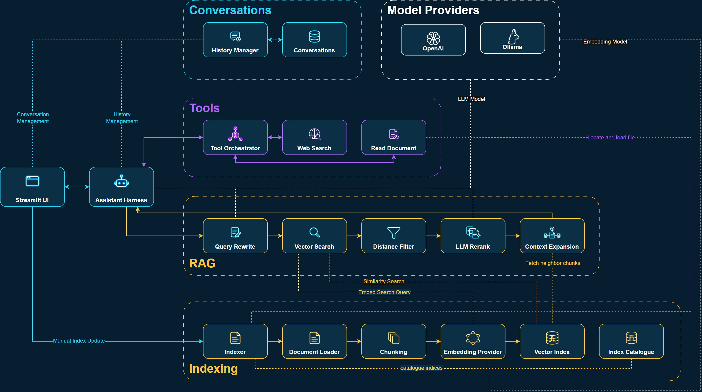
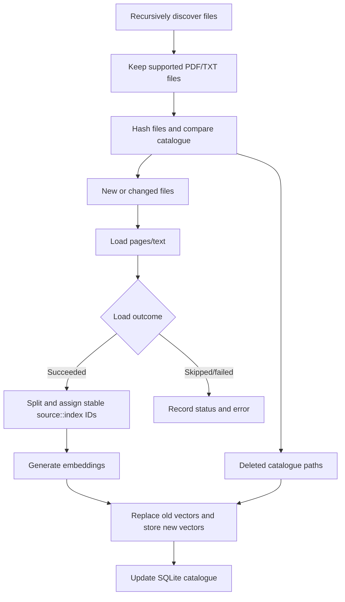
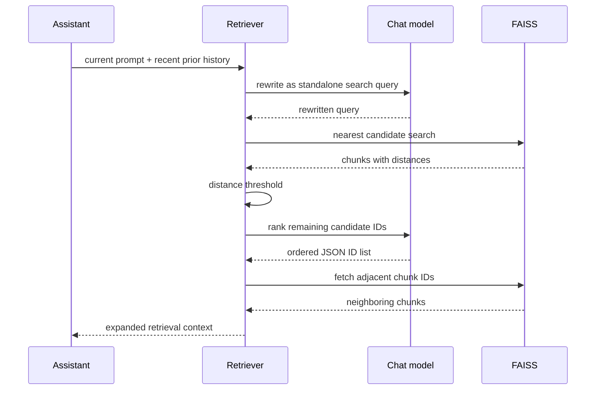

# Architecture

Learning AI Assistant is organized around small provider and service boundaries rather than a framework-owned agent abstraction. The application controls retrieval, persistence, tool execution, and failure behavior explicitly; the selected chat model decides only when and how to call the tools it is offered.



## Component responsibilities

| Component | Responsibility |
|---|---|
| `app.py` | Configures logging and providers, constructs services, caches expensive RAG resources, and renders Streamlit controls. |
| `Assistant` | Owns the per-turn control flow: retrieval, prompt assembly, streamed model events, bounded tool calls, and final history persistence. |
| `HistoryManager` | Connects the active Streamlit session to persistent conversations. |
| `ConversationManager` | Stores conversations and final user/assistant messages in SQLite. |
| `Indexer` | Coordinates discovery, change detection, loading, chunking, embedding, vector replacement, and status updates. |
| `IndexCatalog` | Persists file hashes, chunk counts, statuses, errors, and the indexing configuration signature. |
| `Retriever` | Rewrites the query, searches FAISS, filters by distance, reranks candidates, and expands neighboring chunks. |
| `VectorStore` | Wraps FAISS persistence, vector search, ID-based lookup, addition, and deletion. |
| `LLMProvider` | Defines common chat, streaming, and tool-call operations for OpenAI and Ollama. |
| `EmbeddingProvider` | Defines document and query embedding operations for OpenAI and Ollama. |
| `ToolOrchestrator` | Registers unique tool names, exposes their definitions, dispatches calls, and returns structured errors. |
| `ReadDocumentTool` | Reads an indexed source by exact filename when chunk retrieval is insufficient. |
| `WebSearchTool` | Sends a query to Tavily and returns titled, linked result excerpts when explicitly enabled. |

## Application construction

Streamlit reruns `main()` after interactions. Model providers, the FAISS wrapper, and the retriever are created in `create_rag_resources()` and retained with `st.cache_resource`, avoiding an index and model-client reload on every UI action.

The remaining lightweight stateful services are then assembled:

```text
ConversationManager -> HistoryManager
EmbeddingProvider + VectorStore -> Indexer
Indexer -> ReadDocumentTool
ReadDocumentTool + optional WebSearchTool -> ToolOrchestrator
LLMProvider + HistoryManager + Retriever + ToolOrchestrator -> Assistant
```

The application always registers document reading. Web search is registered only when `WEB_SEARCH_ENABLED` is true and `TAVILY_API_KEY` is non-empty.

## Conversation persistence

Conversation persistence uses two SQLite tables:

```text
conversations
  id (primary key)
  title
  created_at
  updated_at

messages
  id (primary key and chronological sequence)
  conversation_id (foreign key with cascading delete)
  role
  content
  created_at
```

`HistoryManager` keeps only the active conversation ID in `st.session_state`; message content lives in SQLite. At startup it reuses a valid active ID, otherwise selects the most recently updated conversation, otherwise creates a new one. The sidebar supports creation, selection, manual renaming, and deletion.

Limited message queries select the newest rows in descending order, apply SQL `LIMIT`, and reverse the result so the model still receives chronological order. This avoids loading an entire long conversation merely to use its latest context window.

Only the current user message and completed assistant answer are persisted. Tool-call messages and tool results remain ephemeral within the current turn, keeping stored history readable and preventing low-level orchestration messages from appearing as conversation content.

## Indexing pipeline

Indexing is triggered manually from the Streamlit sidebar. The application does not watch the configured document directory for changes in the background.



### Change detection

Every supported file is identified by its path and a SHA-256 content hash. The catalogue also stores a deterministic signature containing:

- chunk size;
- chunk overlap;
- embedding provider;
- embedding model.

A file is reprocessed when it is new, its content hash changed, its configuration signature changed, or its previous status was failed. Catalogue paths absent from the current discovery result are treated as deleted.

Hashing reads files in blocks, so even large files do not need to be loaded into memory as one byte string. Unchanged documents are not loaded, chunked, or embedded again.

### Loading and chunk identity

PDF files are loaded as page documents through `PyPDFLoader`; text files are read as UTF-8. Both receive `filename` and `source` metadata. `RecursiveCharacterTextSplitter` copies that metadata into chunks, after which the indexer assigns IDs in this form:

```text
<source path>::<zero-based chunk index>
```

Stable, source-scoped IDs make it possible to replace one document's vectors and fetch a selected chunk's immediate neighbors.

### Provider-specific storage

The embedding provider and model are sanitized into an index-directory name such as `ollama--embeddinggemma`. Each directory contains:

- `index.faiss` for vectors;
- `index.pkl` for LangChain's document/ID mapping;
- `catalog.db` for indexing metadata and status.

Both FAISS files must exist together. Partial state raises an error instead of silently treating the index as empty. Changing only the chat model reuses the same index; changing embeddings selects a separate one.

## Retrieval pipeline



### 1. History-aware query rewriting

The current prompt and a small snapshot of prior user/assistant messages are sent to the configured chat model. A dedicated one-shot prompt asks for one standalone noun-phrase query, resolves conversational references, preserves retrieval constraints, and prohibits answering or inventing likely content.

The current message is not yet in persistent history, so it is appended exactly once to the rewrite request. If rewriting raises an exception or returns blank output, retrieval falls back to the original user text.

### 2. Candidate search and threshold

FAISS embeds the rewritten query and returns a wider candidate pool with distances. Candidates above `RAG_MAX_DISTANCE` are removed before model-based reranking. The logs expose candidate IDs, source filenames, and distances so the threshold can be evaluated against a real corpus.

The threshold is an embedding-distance cutoff, not a calibrated probability. It deliberately prevents unrelated local material from being forced into questions that are better answered directly or through web search.

### 3. LLM reranking and validation

Remaining chunks are labeled with temporary IDs such as `doc_0` and supplied to the chat model. The model must return one JSON array ordered by relevance and may choose fewer than the requested maximum—or none—when sources do not help.

Candidate content is explicitly treated as untrusted data. If the model call fails, JSON is malformed, or the response is unusable, the retriever falls back to the original vector order. A valid empty list is respected as the model's relevance decision.

### 4. Context expansion

For every reranked chunk, the retriever requests IDs within the configured radius from the same source. Missing boundary chunks are ignored and duplicate neighbors are removed. Expansion happens after reranking, so the reranker evaluates focused evidence while the answering model receives enough surrounding text to interpret it.

## Assistant and tool loop

The answer-generation request contains:

1. the main assistant instruction;
2. tool-selection guidance and examples;
3. retrieved chunks with filename and page metadata;
4. the configured window of stored conversation messages, including the current user message;
5. definitions for currently registered tools.

The model response is streamed as events. If no tool call is present, the completed content is stored and the turn ends. If a tool is requested, the assistant appends the model's tool-call message and the orchestrator's result to the in-memory message list, then asks the model again.

Tool input is validated inside each tool. Unknown names, malformed arguments, missing documents, service failures, and empty results become `ToolResult` errors that the model can interpret instead of crashing the turn.

After `MAX_TOOL_CALLS`, tool definitions are removed and a system message requires an answer from the information already collected. This final response is streamed and persisted normally.

> **Sequence-visual placeholder:** Add a screenshot or presentation diagram showing one web-search turn: initial model request, tool call, Tavily result, second model request, and final streamed answer.

## Tool boundaries

Tools are ordinary Python classes implementing a small interface:

```text
ToolDefinition: name + description + JSON input schema
Tool.execute(arguments) -> ToolResult(content, is_error)
```

This keeps the assistant independent of individual integrations. A new direct tool requires an implementation plus registration in application wiring; the assistant loop itself does not change.

The current design does not use MCP. An MCP adapter could later implement the same internal boundary and translate externally discovered tool definitions and results without replacing the assistant control loop.

### Document-reading safety boundary

The model supplies only a filename. The tool resolves that name against successful catalogue records and rejects missing or duplicate matches before loading the known path. It therefore does not expose a general filesystem-read primitive.

### Web-search boundary

Web search is opt-in, requires a Tavily key, requests result excerpts rather than raw pages, and truncates the formatted output. Search content is marked as untrusted in the tool system prompt. URL citation still depends on the model following the supplied instruction.

## Provider abstraction

`LLMProvider` defines four operations:

- non-streaming chat;
- streaming chat;
- non-streaming chat with tools;
- streaming chat with tools.

OpenAI and Ollama adapters translate the repository's `Message`, `ToolCall`, and `ToolDefinition` entities into LangChain messages and provider calls. `EmbeddingProvider` similarly hides document/query embedding implementation details.

The same configured chat model performs answer generation, query rewriting, and reranking. This avoids a second model configuration but couples retrieval latency and quality to the chosen chat model.

## Observability

Application logs report technical decisions without dumping entire documents into the terminal. They include file/index changes, rewritten queries, candidate distances, threshold counts, reranked chunks, expansion ranges, tool calls, result titles/URLs, and persisted messages.

For deeper inspection, `prompt_debug.txt` records the complete latest assistant-loop request and available tool definitions. It is deliberately excluded from Git but may contain sensitive data. Retrieval rewrite and rerank prompts are visible through targeted logging rather than appended to that dump.

## Design tradeoffs and limitations

- **Explicit orchestration:** The control loop is easy to inspect and extend, but it implements fewer production safeguards than a mature agent runtime.
- **SQLite persistence:** Appropriate for a local single-user process; concurrent multi-instance operation is not a design goal.
- **Dense retrieval:** Simple and effective for semantic similarity, but exact term matching can be weaker than hybrid vector/BM25 retrieval.
- **LLM-based rewriting and reranking:** Demonstrates prompting techniques and adds semantic judgment, but increases latency and can produce inconsistent outputs. Defensive fallbacks preserve basic retrieval.
- **Context expansion:** Restores local continuity without reranking large passages, but can increase prompt size beyond the nominal top-k setting.
- **Provider mixing:** Flexible and useful for experimentation, but users must reason about which data crosses each provider boundary.
- **Local prompt diagnostics:** Valuable during development and demonstrations, but inappropriate for deployments that prohibit full prompt retention.

## Natural extension points

The present boundaries support later additions without restructuring the whole application:

- implement another `Tool` directly or through an MCP adapter;
- add OCR or a loader for another format behind `DocumentLoader`;
- add deterministic citation rendering after answer generation;
- introduce BM25 and score fusion before reranking;
- replace full-message context with summaries while preserving SQLite history;
- expose provider and model selection through deployment configuration or a UI;
- add authentication and connection lifecycle management for multi-user deployment.
